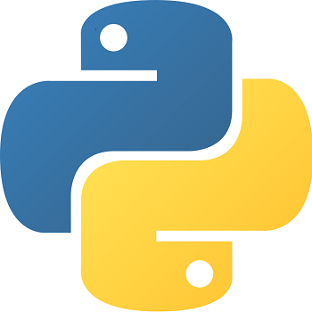
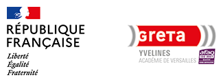

  
# Projet de formation

Des projets développés lors de la formation "Developpement Python" avec le GRETA de Saint Germain en Laye de décembre 2021 à février 2022.
https://www.greta-yvelines.fr/4-actualites/39725-formation-developpeur-python-1

## Chercher le mot
Autour du jeu du pendu
- une version fonctionnelle en mode console
- un clavier et un affichage du game-over en TK
- le tout en programmation orienté objet

## Jeu de carte
Exercice avec un jeu de carte en TK et orienté objet

## premier site en django
Site fait en deux jours lors de la formation pour apprendre à afficher des résultats de wikidata.

## perso_jdr
Pour s'initier aux héritages.
